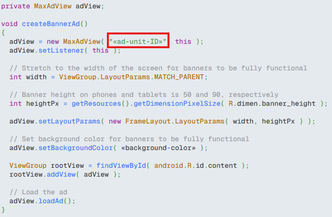

# 광고 설정

## 광고 송출
AppLovin MAX 3rd Party Adapter의 경우 AppLovin MAX 미디에이션을 통해 광고를 송출합니다.  
따라서 이미 AppLovin MAX 통해 광고를 송출하고 있는 경우 앱쪽에서는 별도로 추가할 내용은 없습니다.  
만약 AppLovin MAX 광고 송출을 위한 기능 개발이 되어 있지 않은 경우 아래 링크를 통해 AppLovin MAX 광고 송출을 할 수 있도록 적용 하시면 됩니다.

* Android : [AppLovin MAX Android 가이드 바로가기](https://support.axon.ai/en/max/android/overview/integration)
* iOS : [AppLovin MAX iOS 가이드 바로가기](https://support.axon.ai/en/max/ios/ad-formats/app-open-ads)

## AppLovin MAX 관리자 콘솔 설정
위 링크는 AppLovin MAX 3rd-Party Adapter 적용을 위한 맞춤 이벤트 설정에 대한 안내 링크 입니다.  참고하시면 되며, 자세한 내용은 아래를 참고 하시면됩니다.

여기에서는 모비온 앱을 대상으로 하여, 광고 유닛을 새롭게 생성하는 부분부터 안내됩니다.    
이미 적용된 내용이 있다면 아래 내용을 참고하셔서 적절히 활용하시면 됩니다.  
예시의 경우 배너 광고를 대상으로 하며, 전면, 리워드 등 광고 유닛의 생성을 제외하면 동일하니 참고 바랍니다.

### 1. Custom Networks (Mobwith SDK) 생성 
AppLovin SDK에서 Mobwith SDK를 Mediation 하기 위해서 Custom Network를 설정해야 합니다.  
- <h5> MAX -> Mediation -> Networks 탭에 진입합니다.</h5>
- <h5> 화면 최하단의 'Click here to add a Custom Network'에 진입합니다.</h5>
  
     
- <h5> 아래 사진처럼 Custom Network를 생성합니다.</h5>
  
     
- <h5> Custom Network 등록이 완료되면 아래의 화면처럼 구성됩니다.</h5>

     
  

### 2. 광고 유닛 생성
해당 단계를 위해선 위의 1. Custom Network Mobwith SDK를 설정하여야 합니다.   

- <h5> MAX -> Mediation -> Ad Units 탭에 진입합니다.</h5>
- <h5> 화면 우측 상단의 'Create Ad Unit'에 진입합니다.</h5>

     
- <h5> 원하는 광고 타입으로 광고를 설정합니다. (예시에선 Banner 광고로 설정함)</h5>
  
     
- <h5> 위 설정한 Custom Network를 설정합니다. 이 후 Mobwith에서 발급받은 unitId를 Custom Parameters에 예시 Json 포맷(예시 : {"unitId":"00000000"})에 맞춰 설정합니다.</h5>
  
    
- <h5>Ad Units 설정이 완료되면 아래와 같이 Ad Unit Id가 생성됩니다.</h5>

  

### 3. AppLovin MAX SDK 적용
앱 프로젝트에 AppLovin MAX 광고를 추가합니다. ([AppLovin MAX SDK 설정 가이드](https://support.axon.ai/en/max/android/ad-formats/banner-and-mrec-ads))
- <h5>위 과정에서 생성한 Ad Unit Id를 설정합니다. 아래의 예시는 Banner 광고 입니다. 자세한 사항은 위 SDK 설정 가이드를 참고하여 알맞는 포맷의 광고를 구현하시기 바랍니다. </h5>

  