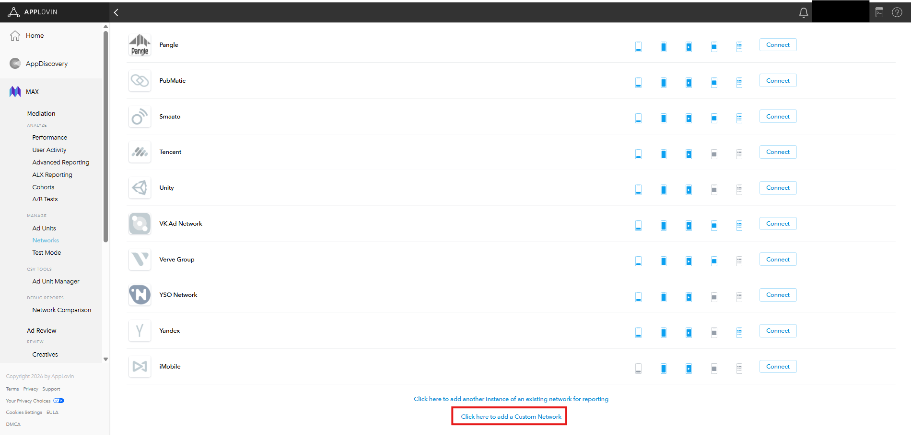
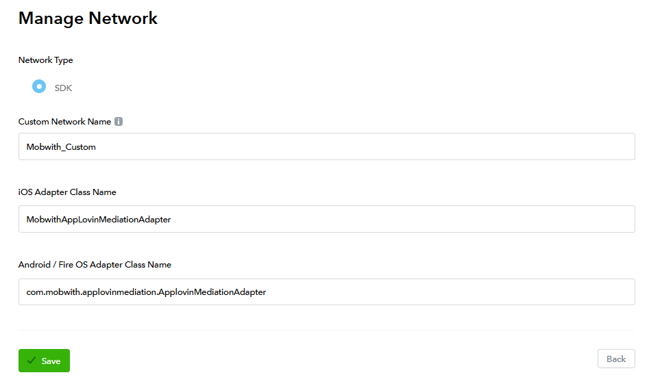
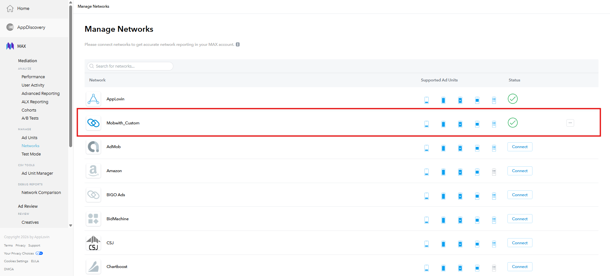
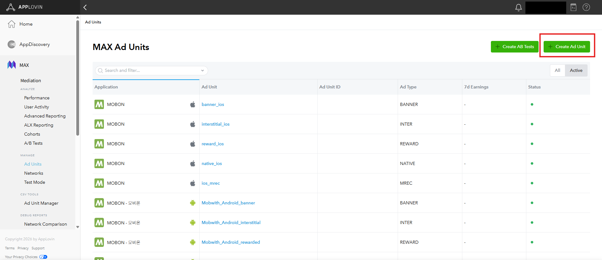
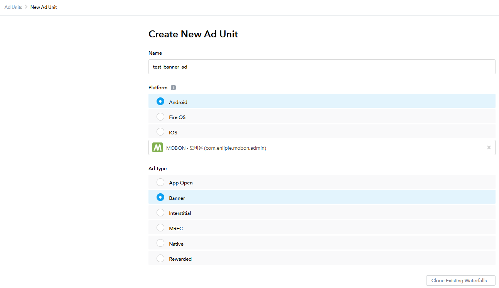
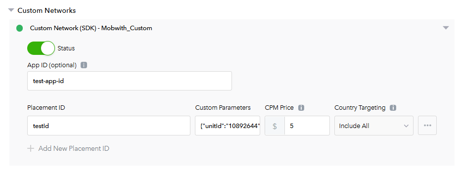
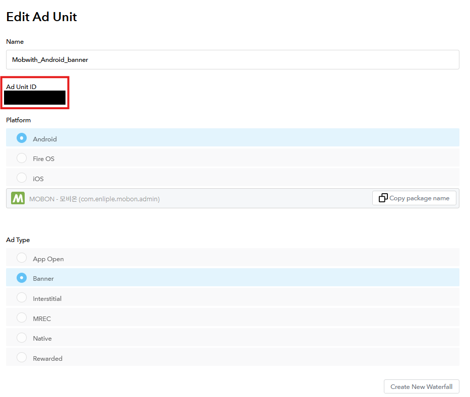

🌐 [한국어 가이드](/CustomAdapter/Applovin/loadAd)

# Ad Configuration

## Ad Serving

For the AppLovin MAX 3rd Party Adapter, ads are served through AppLovin MAX mediation.  
Therefore, if you are already serving ads through AppLovin MAX, there is nothing additional to add on the app side.  
If the functionality for serving AppLovin MAX ads has not been implemented yet, use the links below to set up AppLovin MAX ad serving.

* Android : [Go to the AppLovin MAX Android guide](https://support.axon.ai/en/max/android/overview/integration)
* iOS : [Go to the AppLovin MAX iOS guide](https://support.axon.ai/en/max/ios/ad-formats/app-open-ads)

## AppLovin MAX Admin Console Setup

The links above guide you through the custom event setup for applying the AppLovin MAX 3rd-Party Adapter. Refer to them, and see below for more details.

This guide walks through the process starting from creating a new ad unit, using the Mobon app as the target.  
If you already have a configuration in place, refer to the content below and apply it as appropriate.  
The example targets a banner ad; apart from creating the ad unit (interstitial, rewarded, etc.), the process is the same, so use it as a reference.

### 1. Create a Custom Network (Mobwith SDK)

To mediate the Mobwith SDK within the AppLovin SDK, you must set up a Custom Network.

- Go to the MAX -> Mediation -> Networks tab.
- At the bottom of the screen, click 'Click here to add a Custom Network'.

- Create a Custom Network as shown below.

| Field | Description |
|:---:|:---|
| **Custom Network Name** | A name to distinguish this entry in the mediation ad settings. Use a name that is easy to identify. |
| **IOS Adapter Class Name** | The iOS 3rd-party mediation Adapter class name. Enter `MobwithAppLovinMediationAdapter`. |
| **Android / Fire OS Adapter Class Name** | The Android 3rd-party mediation Adapter class name. Enter `com.mobwith.applovinmediation.ApplovinMediationAdapter`. |

- Once the Custom Network is registered, the following screen appears.

### 2. Create an Ad Unit

This step requires the '1. Create a Custom Network (Mobwith SDK)' setup above.

- Go to the MAX -> Mediation -> Ad Units tab.
- Click 'Create Ad Unit' at the top right of the screen. However, if you have already created an AppLovin MAX ad, go to the Custom Network settings and complete the process.
- Configure the ad with your desired ad type. (The example uses a Banner ad.)

#### Custom Network Settings

Set the Custom Network on the ad unit configured above. Then set the unitId issued by Mobwith in Custom Parameters, following the example JSON format (e.g., {"unitId":"00000000", "adSize": "320x50"}).

| Field | Description |
|:---:|:---|
| **App ID (optional)** | A unique ID assigned to the app. Use a name that is easy to identify. |
| **Placement ID** | The placement ID. Use a name that is easy to identify. |
| **Custom Parameters** | Adapter parameters are passed in JSON format.  **Key Description** - `unitId` : MobWith Ad Placement ID - `adSize` : Banner ad size (`320x50`, `320x100`, `300x250`) &nbsp;&nbsp;&nbsp;&nbsp;※ Select the appropriate size for the banner ad &nbsp;&nbsp;&nbsp;&nbsp;※ For Interstitial/Rewarded ads, any value can be used  

**Example** 
`{"unitId": "10892095", "adSize": "320x100" }` |
| **CPM Price** | The ad price generated per 1,000 ad impressions. |

- Once the Ad Unit settings are complete, an Ad Unit ID is generated.

