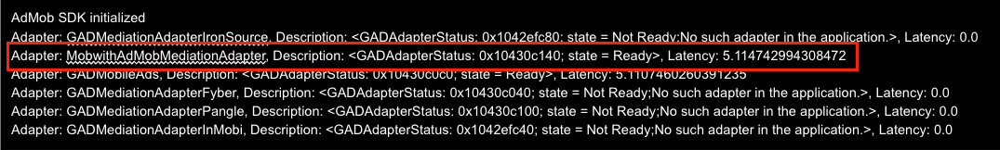

🌐 <a href="../ko/#/CustomAdapter/AdMob/install">한국어 가이드</a>

# AdMob 3rd Party Adapter SDK installation

This is a guide for using the AdMob 3rd Party Adapter.
Please install both of the SDKs described below.


### 1. Install MobWithAdSDK
Refer to the following links to add the Mobwith Ad SDK to your project. 
For the parts that each per-OS SDK requires you to add for mediation, apply them according to the agreed-upon content. 
- Android : [[Guide Document Link](/Android/installation.md)]
- iOS : [[Guide Document Link](/iOS/installation_base.md)]


### 2. Add the AdMob 3rd-Party Adapter SDK
Include the AAR file (Android) or xcframework (iOS) provided to you separately in your project.


### 3. Verifying that SDK installation is complete
You can verify whether the SDK was installed correctly via the callback of AdMob's initialization function.  
Please refer to the content below for each OS to verify that the SDK was installed correctly.  
For reference, mediation setup must first be completed in the AdMob admin console.

#### Android
Output logs via the initialization function below.
```
MobileAds.initialize(context, new OnInitializationCompleteListener() {
    @Override
    public void onInitializationComplete(@NonNull InitializationStatus initializationStatus) {
        Log.d("Admob", "AdMob SDK initialized");

        if (Build.VERSION.SDK_INT >= Build.VERSION_CODES.N) {
            initializationStatus.getAdapterStatusMap().forEach((s, adapterStatus) -> {
                String log = "Adapter: " + s +
                        ", State: " + adapterStatus.getInitializationState() +
                        ", Latency: " + adapterStatus.getLatency() +
                        ", Description: " + adapterStatus.getDescription();
                Log.d("Admob",log);
            });
        }
    }
});
```
If you see the same name as in the red box in the screenshot below, it has been installed correctly.


#### iOS
Output logs via the initialization function callback below.
```
MobileAds.shared.start { [weak self] initializationStatus in
    print("AdMob SDK initialized")

    for (adapterName, status) in initializationStatus.adapterStatusesByClassName {
        print("Adapter: \(adapterName), Description: \(status.description), Latency: \(status.latency)")
    }
}
```
If you see the same name as in the red box in the screenshot below, it has been installed correctly.



### 4. Notes
* The method for applying the SDK may change after the SDK is officially distributed in the future.
* The planned distribution method is via Maven for Android, and via CocoaPods (using a Custom Repo) or SPM (Swift Package Manager) for iOS.
* The 3rd Party Adapter participates as a 3rd party in AdMob SDK mediation, so the AdMob SDK must be installed in the project.
* If the AdMob SDK is not installed, you must install the AdMob SDK and configure ads via the per-OS links below.
  * Android : [Go to the AdMob Android guide](https://developers.google.com/admob/android/quick-start)
  * iOS : [Go to the AdMob iOS guide](https://developers.google.com/admob/ios/quick-start)


