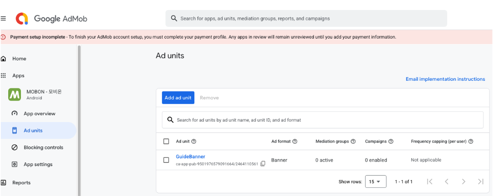
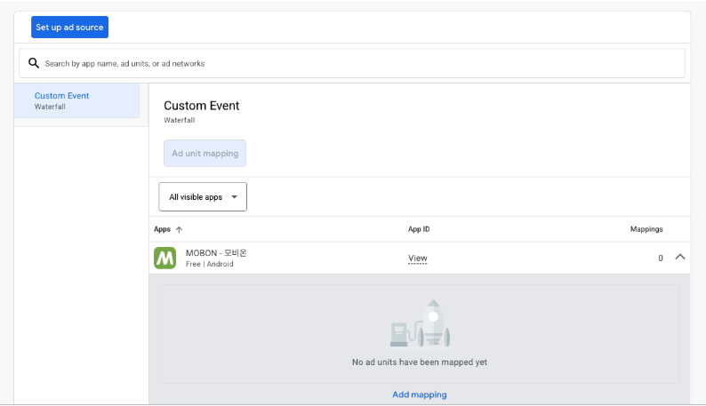
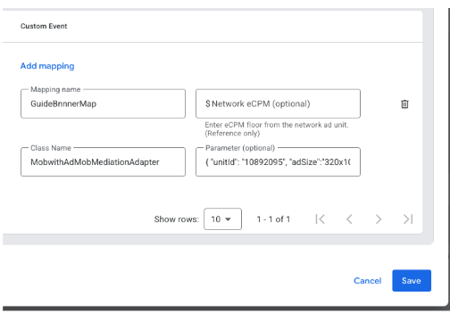
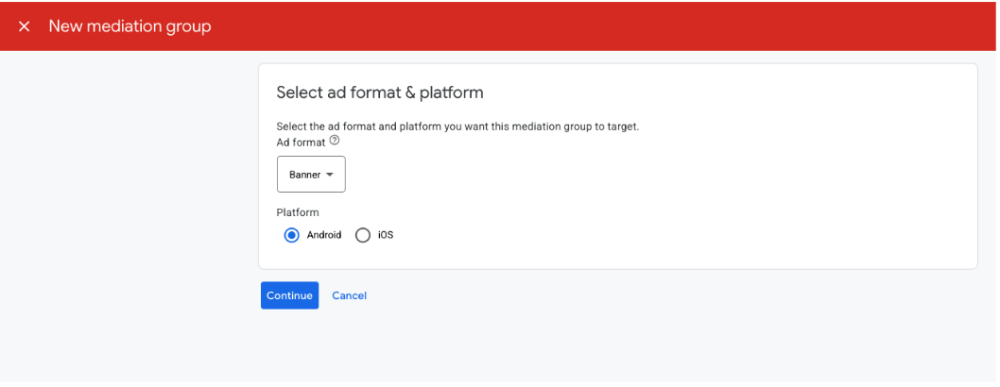
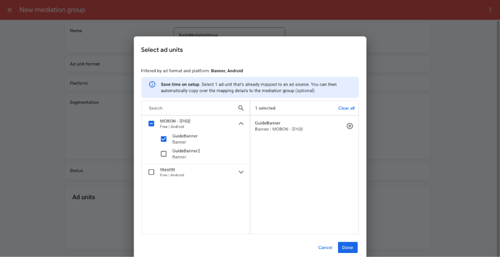
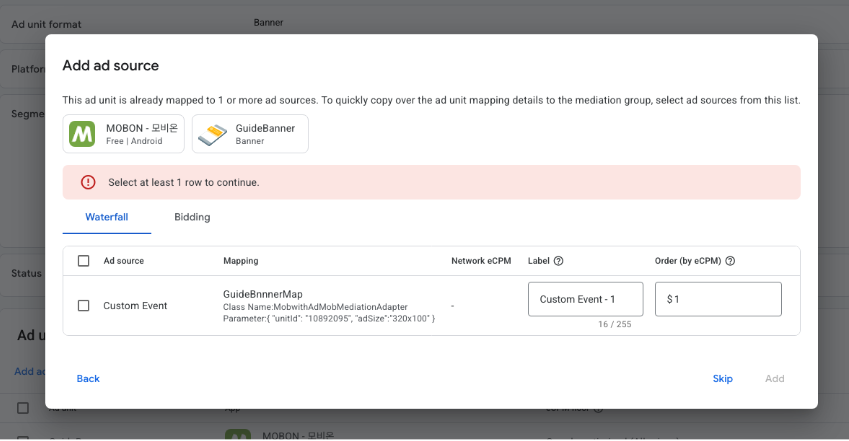

🌐 <a href="../ko/#/CustomAdapter/AdMob/loadAd">한국어 가이드</a>

# Ad configuration

## Ad serving
The AdMob 3rd Party Adapter serves ads through AdMob's mediation.  
Therefore, if you are already serving ads through AdMob, there is nothing additional to add on the app side.  
If functionality for serving ads via AdMob has not been developed, you can apply it via the links below so that you can serve AdMob ads.
* Android : [Go to the AdMob Android guide](https://developers.google.com/admob/android/quick-start)
* iOS : [Go to the AdMob iOS guide](https://developers.google.com/admob/ios/quick-start)

## AdMob admin console setup
[[AdMob Guide Link](https://support.google.com/admob/answer/13407144?hl=ko&ref_topic=13397014&sjid=17037658148373066852-NC)]   
The link above is a guide for setting up a custom event to apply Google's 3rd-Party Adapter.  
You can refer to it, and for details, please refer to the content below.

Here, targeting the Mobon app, the guide starts from the part where you newly create an ad unit. (The process of creating an ad unit is omitted.)  
If you already have something applied, refer to the content below and use it appropriately.  
The example targets a banner ad, and except for creating ad units such as interstitial and reward, it is the same, so please take note.

### 1. Create an ad unit
On the screen below, press the 'Add ad unit' button and create an AdMob ad unit following the guided process.  
Once ad unit creation is complete, the created ad unit is shown in a list, like 'GuideBanner' in the screenshot below.  
  

### 2. Create a Waterfall Source
First, in the right panel, select Mediation -> Waterfall Source to navigate there.  
Once the screen has changed, you can see a screen like the screenshot below.  
  
Press 'Add mapping' at the bottom of the screenshot above.  

If a waterfall source is already registered, a screen like the screenshot below appears.  
  
Here, press 'Manage mappings' as shown on the screen.  

When you press 'Add mapping' or 'Manage mappings' above, a screen like the screenshot below appears.  
  

If you have something already registered, it is shown in the form below.  
  

When you press 'Add mapping' shown in the two screenshots above, one more set of input forms is added to the list, and enter the values by referring to the following.  

| Field name | Description |
| :----: | :---- |
| **Mapping Name** | A name to distinguish this item in the mediation ad settings. Use a name that is easy to identify. |
| **Network eCPM (optional)** | Enter the eCPM value. Since it can be set separately later, it is not required.  |
| **Class Name** | The 3rd-party mediation Adapter class name.  **Android** `com.mobwith.admopmediation.AdmobMediationAdapter`  **iOS** `MobwithAdMobMediationAdapter` |
| **Parameter (optional)** | The parameters passed to the Adapter. Uses JSON format.  **Key descriptions** - `unitId` : the MobWith ad placement number - `adSize` : the banner ad size(choose the correct size among `320x50`, `320x100`, `300x250`) &nbsp;&nbsp;&nbsp;&nbsp;※ For interstitial/reward, any value can be used  **Example** `{"unitId": "10892095", "adSize": "320x100" }` |

After entering the values by referring to the above, press the 'Save' button in the screenshot above to save the changes and move on to the next step.  

### 2. Create a Mediation Group
Once you have completed the steps above, navigate to 'Mediation groups' as in the screenshot below.  
  

When you press 'Create mediation group' in the screenshot above, a screen like the screenshot below is displayed.  
  
After selecting the ad type and platform to which mediation will be applied, press the 'Continue' button to move to the next step.  

When a screen like the screenshot below is displayed, enter an appropriate name in Name and then press 'Add ad units' at the bottom.  
  

Then a window for selecting an Ad Unit appears as in the screenshot below, and the items created in the waterfall source creation step above are displayed.  
  
After selecting the ad Unit to apply, press the 'Done' button.  

After that, when a screen like the next screenshot is displayed, enter values in 'Label' and 'eCPM'.  
The frequency of Mobwith ad display is determined by the eCPM you set here, so you must enter the value agreed upon with our representative.  
  
Once the required values are entered, the 'Add' button becomes active; press that button to finish.  

When you press the 'Add' button and the addition of the waterfall source is complete, it is displayed on screen as in the screenshot below.   
If you hover the cursor over the name and eCPM items you specified above, an edit icon is displayed, and you can click to edit, so please take note.
  

After checking the applied content and if there are no problems, press the 'Save' button to save.  
As in the screenshot below, when you press the 'Save' button and saving is complete, that button is disabled; press the 'X' button at the top-left to exit the screen.
  

Completed!!