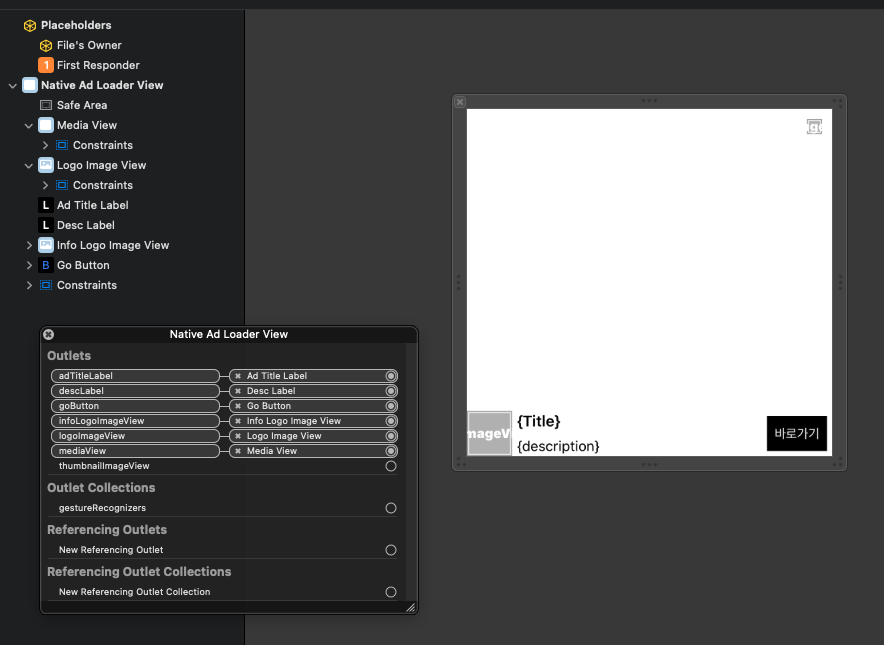

🌐 <a href="../ko/#/iOS/nativeAd">한국어 가이드</a>

## Native AD <!-- {docsify-ignore} -->

## MMNativeAdView
--- 
This is an AdView whose only responsibility is to take the views you set up directly, receive the configured views in the SDK, and set ad data on each view.  
Please note that if the configured Views cannot be recognized, the ad may not display correctly.


### Ad Loading Method 1 - Using MobwithNativeAdViewRender (Recommended)

Introduced in version **1.3.10**, this new approach supports the default UI as well as a dedicated UI for Mobwith Direct Ads.  
With this approach, you assign an ad placement and provide separate Interface Builder (XIB) files to define the ad UI.  
Please refer to the following instructions for creating the ad UI and loading ads.  

#### Creating and Connecting the Ad UI Using Interface Builder (XIB)
First, create the ad UI by referring to the example below.



* This is only a sample layout. Please configure the UI appropriately according to the integration guide of the mediation SDK you are using.  
Next, connect each view by implementing `MobwithNativeAdViewRender` as shown below.

```swift
class DefaultNativeAdView: UIView {
    @IBOutlet weak var mediaView: UIView!
    @IBOutlet weak var adTitleLabel: UILabel!
    @IBOutlet weak var descLabel: UILabel!
    @IBOutlet weak var goButton: UIButton!
    @IBOutlet weak var logoImageView: UIImageView!
    @IBOutlet weak var infoLogoImageView: UIImageView!
}


extension DefaultNativeAdView: MobwithNativeAdViewRender {

    func getMediaView() -> UIView? {
        return mediaView
    }

    func getAdTitleLabel() -> UILabel? {
        return adTitleLabel
    }

    func getAdDescriptionLabel() -> UILabel? {
        return descLabel
    }

    func getGoToSiteButton() -> UIButton? {
        return goButton
    }

    func getAdLogoImageView() -> UIImageView? {
        return logoImageView
    }

    func getInfoLogoImageView() -> UIImageView? {
        return infoLogoImageView
    }
}
```

* Note: When using mediation with the ADOP BidMad SDK, use 'BIDMADNativeAdView' instead of 'UIView'.

<br>
<br>

#### MobwithNativeAdViewRender

Refer to the table below for a description of each function provided by `MobwithNativeAdViewRender`.

| Function | Description |
| ------- | :---- |
| <span style="white-space: nowrap;">func getMediaView() -> UIView?</span> | Connects the View used to display ad content such as images and videos. **(Required)** |
| <span style="white-space: nowrap;">func getAdImageView() -> UIImageView?</span> | Connects the ImageView used to display ad images. Unless you need to explicitly specify an ImageView for image-based ad content, using 'getMediaView()` is recommended. |
| <span style="white-space: nowrap;">func getAdLogoImageView() -> UIImageView?</span> | Connects the ImageView used to display the advertiser's logo. |
| <span style="white-space: nowrap;">func getAdTitleLabel() -> UILabel?</span> | Connects the Label used to display the main ad title. |
| <span style="white-space: nowrap;">func getAdDescriptionLabel() -> UILabel?</span> | Connects the Label used to display the ad description. |
| <span style="white-space: nowrap;">func getGoToSiteButton() -> UIButton?</span> | Connects the Button used for navigating to the ad landing page. This is where the CTA title is displayed. Depending on the ad type and display conditions, this button may not always be used directly for ad clicks. |
| <span style="white-space: nowrap;">func getInfoLogoImageView() -> UIImageView?</span> | Connects the ImageView used to display the ad information icon. **(Required)** |

<br>
<br>

#### Creating MMNativeAdView and Loading Ads

```swift
var nativeAdView = MMNativeAdView(bannerUnitId: defaultMediaCode,
                                  adContainerView: adContainerView,
                                  nibNameForDefault: "DefaultNativeAdView",
                                  nibNameForDirectAd: "DirectNativeAdView",
                                  bundle: Bundle.main)
nativeAdView.adDelegate = self
nativeAdView.rootViewController = self        // For some mediated ad SDKs, ads may not be displayed unless rootViewController is set.

nativeAdView.loadAd()
```

Refer to the table below for details about each parameter.

| Parameter | Description |
| ----: | :---- |
| bannerUnitId | Sets the issued ad placement ID. |
| adContainerView | The root view used to display the ad. |
| nibNameForDefault | Specifies the name of the XIB file that defines the default ad UI. |
| nibNameForDirectAd | Specifies the name of the XIB file used for Mobwith Direct Ads. If not used, leave it unset or provide an empty string. |
| bundle | Specifies the bundle from which the XIB files are loaded. If `nil` is specified, `Bundle.main` is always used. |

<br>
<br>

#### Notes

* If either `nibNameForDefault` or `nibNameForDirectAd` cannot be loaded, the SDK will always return a **No Fill** result and no ad will be displayed.

<br>
<br>  


### Ad Loading Method 2 - Legacy Fixed UI Approach (Not Recommended)  
With this legacy approach, you create the UI for displaying ads in advance and pass each UI component to the SDK.  

```swift
var nativeAdView = MMNativeAdView(bannerUnitId: mediaCode,
                                  adContainerView: adContainerView,
                                  nativeAdRootView: nativeAdRootView,
                                  adImageView: thumbnailImageView,
                                  logoImageView: logoImageView,
                                  titleLabel: titleLabel,
                                  descriptionLabel: descLabel,
                                  gotoSiteButton: goButton,
                                  infoLogoImageView: infoLogoImageView,
                                  mediaView: mediaView)
nativeAdView.adDelegate = self
nativeAdView.rootViewController = self        // For some mediation-applied ad SDKs, the ad may not be displayed if rootViewController is not set.

nativeAdView.loadAd()

```

#### For details on each parameter, please refer to the table below.
----
| Parameter | Description |
| ----:| :----|
| bannerUnitId      | Set the issued ad placement ID. |
| adContainerView   | The RootView that displays the ad View. |
| nativeAdRootView  | The RootView for displaying the Native AD; a View that contains the child Views below.  |
| adImageView       | The ImageView that displays the ad image. You must set a Tag value. |
| logoImageView     | The ImageView that displays the advertiser logo image. You must set a Tag value. |
| titleLabel        | The Label that displays the ad Title. You must set a Tag value.  |
| descriptionLabel  | The Label in which additional content such as the ad description is displayed. You must set a Tag value.  |
| gotoSiteButton    | The Button for navigating to the ad landing page. You must set a Tag value.  |
| infoLogoImageView | The ImageView that displays the ad Info Logo image. You must set a Tag value.  |
| mediaView         | Used to display ad images, videos, etc. during mediation of some external SDKs.   |


#### <B> Cautions when using the ADOP BidMad SDK </B>
When using NativeAd in ADOP's BidMad SDK, it requires using 'BIDMADNativeAdView'. 
To accommodate this, when you want to serve a NativeAd via the BidMad SDK in the Mobwith SDK, you must create the nativeAdRootView as a 'BIDMADNativeAdView' and pass it. 
[[Reference - BidMad SDK iOS Native Ad layout setting guide](https://github.com/bidmad/Bidmad-iOS/wiki/Native-Ad-Layout-Setting-Guide-%5BKOR%5D)]   
* Please note that if you do not create the nativeAdRootView as a BIDMADNativeAdView, ADOP ads are treated as No Fill regardless of whether an ad was received.


### performAdClicked()
If you cannot trigger an ad click via the gotoSiteButton, you can create a separate button and call this function as shown in the example below to trigger an ad click event.
```swift
nativeAdView.performAdClicked()

```
By calling the method above, you can produce the same effect as clicking the ad.


### adDelegate 
The Delegate for receiving callbacks uses [MobWithADViewDelegate](/iOS/banner?id=mobwithadviewdelegate).   

### rootViewController  
For some external SDKs being mediated, they also require setting a rootViewController for the NativeAd.  
For such ads, please note that even if an actual ad is received, it is treated as not received if the rootViewController is not set.

<br><br>

## MobWithNativeAdLoader
---
MobWithNativeAdLoader is a useful feature when you want to display an MMNativeAdView ad in a view of a type such as a ListView.

<br>

### How to load the ad

First, create the View for displaying the ad.  
At this point, these Views must extend MobwithNativeAdViewRender and define each method, and if you use AppLovin, they must inherit from MANativeAdView.

```swift
class NativeAdLoaderView: MANativeAdView {
    static let needHeight:CGFloat = 347.0
    
    @IBOutlet weak var thumbnailImageView: UIImageView!
    @IBOutlet weak var logoImageView: UIImageView!
    @IBOutlet weak var infoLogoImageView: UIImageView!
    
    @IBOutlet weak var adTitleLabel: UILabel!
    @IBOutlet weak var descLabel: UILabel!
    @IBOutlet weak var goButton: UIButton!
        
}


extension NativeAdLoaderView: MobwithNativeAdViewRender {
    
    func getAdImageView() -> UIImageView? {
        return thumbnailImageView
    }
    
    func getAdLogoImageView() -> UIImageView? {
        return logoImageView
    }
    
    func getAdTitleLabel() -> UILabel? {
        return adTitleLabel
    }
    
    func getAdDescriptionLabel() -> UILabel? {
        return descLabel
    }
    
    func getGoToSiteButton() -> UIButton? {
        return goButton
    }
    
    func getInfoLogoImageView() -> UIImageView? {
        return infoLogoImageView
    }
    
}
```
<br>

Next, to load an ad, create and initialize a MobWithNativeAdLoader.  
Pass the View for displaying the ad that you created above.
```swift

//Create MobwithNativeAdLoader
let mediaCodes:[String] = [ "Unit ID" ] //ou must set one or more Unit IDs.
var nativeAdLoader = MobWithNativeAdLoader(unitIds: mediaCodes, nibName: "NativeAdLoaderView", bundle: nil)
nativeAdLoader.nativeAdLoaderDelegate = self
.......
```
<br> 

After that, in a list-type View such as a UITableView, obtain the created ad View as shown below and have it displayed on screen.


```swift

...

func tableView(_ tableView: UITableView, cellForRowAt indexPath: IndexPath) -> UITableViewCell {
  if (indexPath.row % 5 == 4) {
    let cell:UITableViewCell? = tableView.dequeueReusableCell(withIdentifier: "NativeADCellID", for: indexPath)
    
    // When you call loadAd(), if there is an already loaded ad or an already created view, that View is returned.
    // Calling isLoadedAd() returns true if an ad has been received. We recommend checking this value before adding it to the view.
    if let adView = nativeAdLoader.loadAd(At: indexPath), nativeAdLoader.isLoadedAd(At: indexPath) {
      cell?.addSubview(adView)
                
      adView.translatesAutoresizingMaskIntoConstraints = false
      cell?.widthAnchor.constraint(equalTo: adView.widthAnchor).isActive = true
      cell?.heightAnchor.constraint(equalTo: adView.heightAnchor).isActive = true
      cell?.centerXAnchor.constraint(equalTo: adView.centerXAnchor).isActive = true
      cell?.centerYAnchor.constraint(equalTo: adView.centerYAnchor).isActive = true
    }
    else {
      if nativeAdLoader.isFailLoadAd(At: indexPath) {
        nativeAdLoader.retryLoadAd(At: indexPath)
      }
                
      cell?.subviews.forEach({ view in
        (view as? NativeAdLoaderView)?.removeFromSuperview()
      })
    }

    return cell ?? UITableViewCell.init()
  }
  else {
    ...
  }

...

```


## MobWithNativeAdLoaderDelegate
For MobWithNativeAdLoader, because management of list indices, etc. is needed, you must use the separately built MobWithNativeAdLoaderDelegate.  
Please refer to the following for each callback method of the delegate. 
* <b>Caution: For MMNativeAdView's adDelegate, you must use [MobWithADViewDelegate](/iOS/banner?id=mobwithadviewdelegate) </b>

### mobWithNativeAdViewClickedAd()                                
Delivered when the ad is clicked.

### mobWithNativeAdViewDidReceivedAd(At index:IndexPath?)      
Delivered when an ad is received.  
index is the IndexPath value of the location where the ad will be displayed.

### mobWithNativeAdViewDidFailToReceiveAd(At index:IndexPath?) 
Delivered when an ad could not be received.  index is the IndexPath value of the location where the ad will be displayed.
