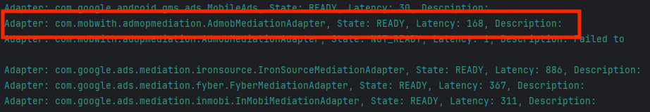

# AdMob 3rd Party Adapter SDK 설치

AdMob 3rd Party Adapter를 사용하기 위한 가이드 입니다.  
아래 설명된 두 SDK를 모두 설치해주시면 됩니다.   


### 1. MobWithAdSDK 설치
다음 링크를 참조하여 프로젝트에 Mobwith Ad SDK를 추가해 줍니다.  
각 OS별 SDK에서 미디에이션을 위해 추가를 요구하는 부분은 협의된 내용에 따라 적용하시면 됩니다.
- Android : [[가이드 문서 링크](../../Android/installation.md)]
- iOS : [[가이드 문서 링크](../../iOS/installation_base.md)]


### 2. AdMob 3rd-Party Adapter SDK 추가
별도로 전달 드린 AAR파일(Android) 또는 xcframework(iOS)를 프로젝트에 포함시켜 줍니다. 


### 3. SDK 설치 완료 확인
AdMob의 초기화 함수의 콜백을 통해 SDK 설치가 제대로 되었는지 확인이 가능 합니다.  
각 OS별 아래 내용을 참고하셔서 SDK가 제대로 설치되었는지 확인 바랍니다.  
참고로 먼저 AdMob 관리자 콘솔에서 미디에이션 설정이 완료 되어야 합니다.  
#### Android
아래 초기화 함수를 통해 로그를 출력합니다.
```
MobileAds.initialize(context, new OnInitializationCompleteListener() {
    @Override
    public void onInitializationComplete(@NonNull InitializationStatus initializationStatus) {
        Log.d("Admob", "AdMob SDK initialized");

        if (Build.VERSION.SDK_INT >= Build.VERSION_CODES.N) {
            initializationStatus.getAdapterStatusMap().forEach((s, adapterStatus) -> {
                String log = "Adapter: " + s +
                        ", State: " + adapterStatus.getInitializationState() +
                        ", Latency: " + adapterStatus.getLatency() +
                        ", Description: " + adapterStatus.getDescription();
                Log.d("Admob",log);
            });
        }
    }
});
```
아래 스크린샷에서 붉은색 박스와 동일한 이름이 보인다면 제대로 설치 된 것 입니다.


#### iOS
아래 초기화 함수 콜백을 통해 로그를 출력합니다.
```
MobileAds.shared.start { [weak self] initializationStatus in
    print("AdMob SDK initialized")

    for (adapterName, status) in initializationStatus.adapterStatusesByClassName {
        print("Adapter: \(adapterName), Description: \(status.description), Latency: \(status.latency)")
    }
}
```
아래 스크린샷에서 붉은색 박스와 동일한 이름이 보인다면 제대로 설치 된 것 입니다.


### 4. 참고 사항
* 향후 정식으로 SDK 배포 이후 SDK를 적용하는 방법이 변경 될 수 있습니다.
* 예정된 배포 방식으로 Android의 경우 Maven으로, iOS의 경우 CocoaPod(Custom Repo 사용) 또는 SPM(Swift Package Manager)로 배포할 예정입니다.
* 3rd Party Adapter의 경우 AdMob SDK의 미디에이션에 3rd Party로 참여하는 것이므로, 해당 프로젝트에 AdMob SDK가 설치되어 있어야 합니다.  
* AdMob SDK를 설치하지 않은 경우 아래 각 OS별 링크를 통해 AdMob SDK의 설치 및 광고 설정을 진행해 주셔야 합니다.  
  * Android : [AdMob Android 가이드 바로가기](https://developers.google.com/admob/android/quick-start)
  * iOS : [AdMob iOS 가이드 바로가기](https://developers.google.com/admob/ios/quick-start)


