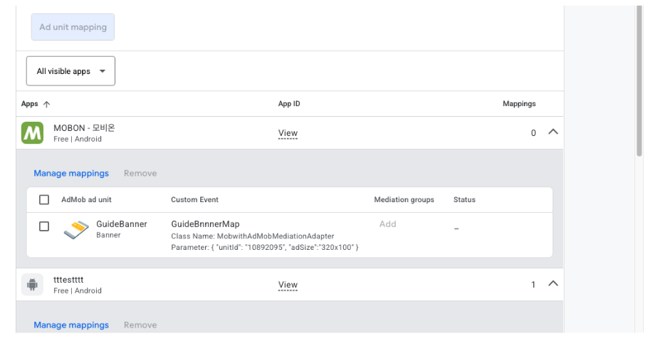
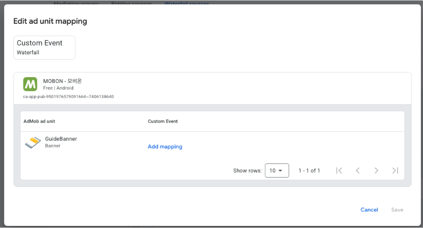
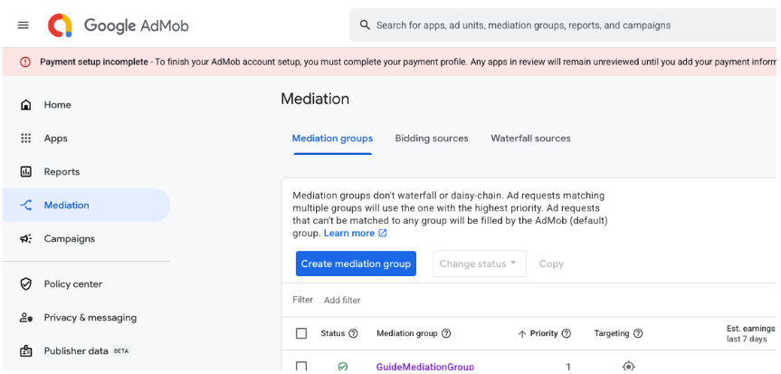
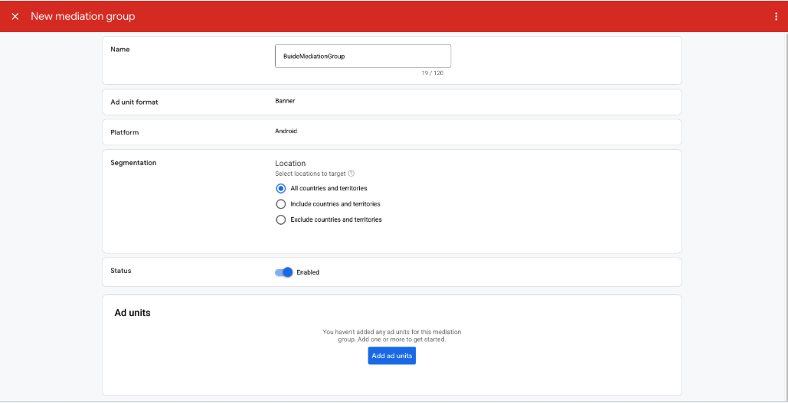
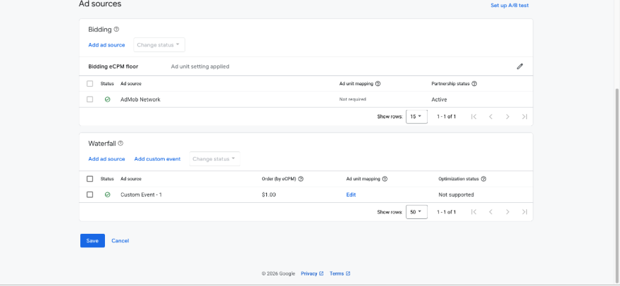
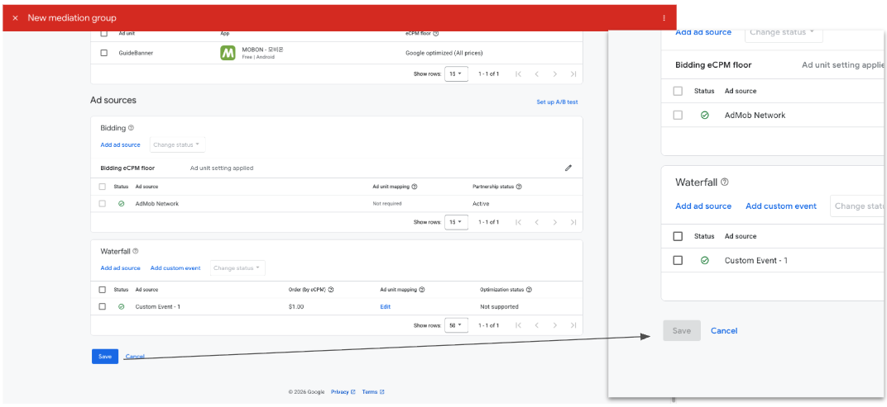

# 광고 설정

## 광고 송출
AdMob 3rd Party Adapter의 경우 AdMob의 미디에이션을 통해 광고를 송출합니다.  
따라서 이미 AdMob를 통해 광고를 송출하고 있는 경우 앱쪽에서는 별도로 추가할 내용은 없습니다.  
만약 AdMob을 광고 송출을 위한 기능 개발이 되어 있지 않은 경우 아래 링크를 통해 AdMob 광고 송출을 할 수 있도록 적용 하시면 됩니다.

* Android : [AdMob Android 가이드 바로가기](https://developers.google.com/admob/android/quick-start)
* iOS : [AdMob iOS 가이드 바로가기](https://developers.google.com/admob/ios/quick-start)

## AdMob 관리자 콘솔 설정
[[AdMob 가이드 링크](https://support.google.com/admob/answer/13407144?hl=ko&ref_topic=13397014&sjid=17037658148373066852-NC)]   
위 링크는 구글의 3rd-Party Adapter 적용을 위한 맞춤 이벤트 설정에 대한 안내 링크 입니다.  참고하시면 되며, 자세한 내용은 아래를 참고 하시면됩니다.

여기에서는 모비온 앱을 대상으로 하여, 광고 유닛을 새롭게 생성하는 부분부터 안내됩니다.(광고 유닛을 생성하는 과정은 생략 됩니다.)    
이미 적용된 내용이 있다면 아래 내용을 참고하셔서 적절히 활용하시면 됩니다.  
예시의 경우 배너 광고를 대상으로 하며, 전면, 리워드 등 광고 유닛의 생성을 제외하면 동일하니 참고 바랍니다.

### 1. 광고 유닛 생성 
아래 화면에서 'Add ad unit' 버튼을 눌러 안내된 과정에 따라 AdMob 광고 유닛을 생성합니다.  
광고 유닛의 생성이 완료되면 아래 스크린샷의 'GuideBanner'와 같이 생성된 광고 유닛이 리스트로 보여집니다.  

### 2. Waterfall Source 생성
먼저 우측 패널에서 Mediation -> Waterfall Source를 선택하여 이동합니다.  
화면 이동이 완료되면 아래 스크린샷과 같은 화면을 볼 수 있습니다.
  
위 스크린샷 하단 부분의 'Add mapping'을 눌러 줍니다.

만약 이미 등록된 waterfall source가 존재하는 경우에는 아래와 스크린샷과 같은 화면이 나타납니다.  
  
여기에서는 화면에 표시된 'Manage mappings'를 눌러주시면 됩니다.  

위에서 'Add mapping' 또는 'Manage mappings'을 눌러주면 아래 스크린샷과 같은 화면이 나타납니다.
  

이미 등록한 내용이 있는 경우 아래와 같은 형태로 보여집니다.  
  

위 두 스크린샷에서 보이는 'Add mapping'을 누르면 입력폼이 리스트로 한 세트가 더 추가가 되며, 아래를 참고하여 값을 입력해 줍니다.  

| 필드 명 | 설명 |
| :----: | :---- |
| **Mapping Name** | 미디에이션 광고 설정에서 해당 항목을 구분하기 위한 이름입니다. 식별하기 쉬운 이름을 사용하세요. |
| **Network eCPM (optional)** | eCPM 값을 입력합니다. 추후 별도로 설정할 수 있으므로 필수 입력은 아닙니다. |
| **Class Name** | 3rd-party 미디에이션 Adapter 클래스명입니다.  **Android** `com.mobwith.admopmediation.AdmobMediationAdapter`  **iOS** `MobwithAdMobMediationAdapter` |
| **Parameter (optional)** | Adapter로 전달되는 파라미터입니다. JSON 형식을 사용합니다.  **Key 설명** - `unitId` : MobWith 광고 지면 번호 - `adSize` : 배너 광고 크기 (`320x50`, `320x100`, `300x250` 중 맞는 사이즈로 선택) &nbsp;&nbsp;&nbsp;&nbsp;※ 전면/리워드는 임의 값 사용 가능  **예시** `{"unitId": "10892095", "adSize": "320x100" }` |

위를 참고하여 값을 입력하신 이후 위 스크린샷의 'Save' 버튼을 눌러 변경사항을 저장후 다음 단계로 넘어 갑니다.

### 2. Mediation Group 생성
위 단계까지 마무리되면 아래 스크린샷 처럼 'Mediation groups'으로 이동합니다.
  

위 스크린샷에서 'Create mediation group'를 눌러 주면 아래 스크린샷과 같은 화면이 표시됩니다.
  
미디에이션을 적용할 광고 타입과 플랫폼을 선택한뒤 'Continue' 버튼을 눌러 다음 단계로 이동합니다.  

아래 스크린샷과 같은 화면이 표시되면 Name에 적절한 이름을 넣어준뒤 하단의 'Add ad units'를 눌러 줍니다.  
  

그러면 아래 스크린샷과 같은 화면이 Ad Unit을 선택하는 창이 나타나며, 위 waterfall source 생성 단계에서 만들어둔 항목들이 표시됩니다. 
  
적용할 광고 Unit을 선택후 'Done' 버튼을 눌러 줍니다.

이후 다음 스크린샷과 같은 화면이 표시되면 'Label'과 'eCPM'에 값을 입력해 줍니다.  
여기에서 설정항 eCPM에 따라 Mobwith 광고의 노출 빈도가 결정되며, 저희쪽 담당자와 협의된 값을 입력하셔야 합니다.  
  
필요한 값의 입력이 완료되면 'Add' 버튼이 활성화되며, 해당 버튼을 눌러 마무리 해 줍니다.

'Add' 버튼을 눌러 waterfall 소스의 추가가 완료되면 아래 스크린샷과 같이 화면에 표시 됩니다.
위에서 지정한 이름과 eCPM 항목 위에 커서를 올리면 편집 아이콘이 표시되며, 클릭하여 수정이 가능하니 참고 하시면 됩니다.
  

적용된 내용 확인후 문제가 없는 경우 'Save' 버튼을 눌러 저장해 줍니다.  
아래 스샷에서처럼 'Save' 버튼을 눌러 저장이 완료되면 해당 버튼이 비활성화 되며, 좌측 상단의 'X' 버튼을 눌러 화면을 빠져 나오시면 됩니다.
  

설정이 마무리 되었습니다.